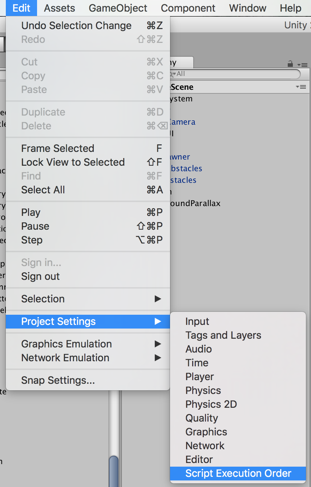

# Grid Layout Group

## Gotchas

- [Dynamic Content](#dynamic-content)


### Dynamic Content

When you are dynamically adding objects to a Grid Layout Group with a Content Size Fitter, you can run into a problem where the content area doesn't properly adjust to the size of the dynamic content. This will likely manifest when your scene is building the content in `Start` or `Awake` and you are using `SceneManager.LoadScene()` to transition to the scene. To overcome this you need to do two things:

 1. Force the grid layout group to resize itself AFTER you've added the content. 
 
```
// Holds the reference to the Object which has the
//  GridLayoutGroup and that content will be added 
//  into.
public GameObject LevelGrid;

void Start() {
    
    // This is your code, where you are adding your content items
    // to the grid content area.  
    this._buildContentInsideOfGrid(); 

    // This only works with Script Execution Order AFTER DefaultTime
    //  because the GridLayouGroup and Canvas size calculations have
    //  not run otherwise, and thus Transitioning to the Scene will
    //  not render the grid layout properly.
    GridLayoutGroup glg =  LevelGrid.GetComponent<GridLayoutGroup>();
    LevelGrid.transform.parent.gameObject.SetActive(false);
    LevelGrid.transform.parent.gameObject.SetActive(true);
    k
}
```
 2. Set the script's execution order AFTER the "default time"

    
    
